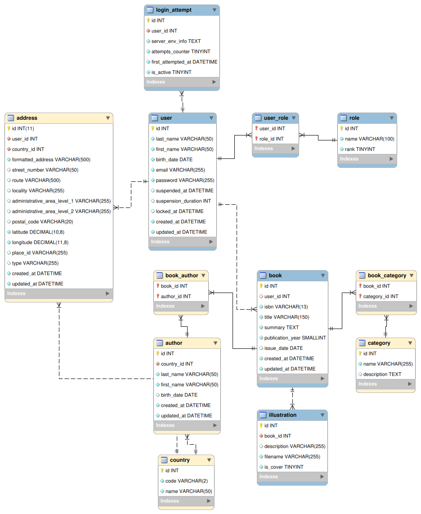

# MediaTek-Demo

## Pré-requis

Disposer d'un environnement de travail doté :
1. D'un serveur Web local (ex. : Apache).
2. Du module PHP associé au serveur Web local.
3. D'un SGBD MySQL ou MariaDB.

Des solutions _all-in-one_ existent :
- WampServer (Windows) : [WampServer, la plate-forme de développement Web sous Windows - Apache, MySQL, PHP](https://www.wampserver.com/).
- XAMPP (_cross-platforms_) : [XAMPP Installers and Downloads for Apache Friends](https://www.apachefriends.org/fr/index.html).
- MAMP (_cross-platforms_) : [MAMP & MAMP PRO - your local web development solution for PHP and WordPress development](https://www.mamp.info/en/windows/).

## Installation du projet

### Code source

Via la commande `git clone` depuis votre dossier de travail (*document root*), par exemple `www/` ou `htdocs/` selon
l'environnement serveur utilisé :

```shell
git clone git@github.com:El-Profesor/MediaTek-Demo.git mediatek
```

**Note :** il est également possible de télécharger le code source du projet sous forme d'une archive au format ZIP.

### Base de données associée

Depuis phpMyAdmin :

1. Création d'une base de données nommée `mediatek` (avec interclassement `utf8mb4_unicode_ci`).
2. Sélection de la base de données `mediatek` créée.
3. Via l'onglet **Importer**, import du fichier `mediatek_full.sql` (dossier `stuff/db/`) qui contient un jeu de données.

Dans le code source, ajuster les valeurs par rapport à votre serveur MySQL (plusieurs scripts PHP sont concernés) :

```php
 $host = 'localhost';
 $dbName = 'mediatek';
 $user = 'mentor'; // Your MySQL user username
 $pass = 'superMentor'; // Your MySQL user password
```

### Vérification de l'installation

- *Front-office* : [http://localhost/mediatek/](http://localhost/mediatek/ "Accès au front-office")
- *Back-office* : [http://localhost/mediatek/admin/](http://localhost/mediatek/admin/ "Accès au back-office")

## Modèle Entité-Association Étendu

Ou *« enhanced entity-relationship » diagram* (EER), seules les entités en **bleu** sont à prendre en considération :



## Avertissement

Ce dépôt a été conçu à des fins pédagogiques pour illustrer des concepts et des principes spécifiques. Le code n'est pas destiné à être utilisé en production, car il peut ne pas répondre aux exigences de sécurité, de qualité, de robustesse et de performance nécessaires dans un environnement professionnel. Il sert uniquement à des fins d'apprentissage et ne doit pas être considéré comme un modèle de développement. Ce code est donc fourni à des fins éducatives et sans engagement de performance ou de fiabilité.
